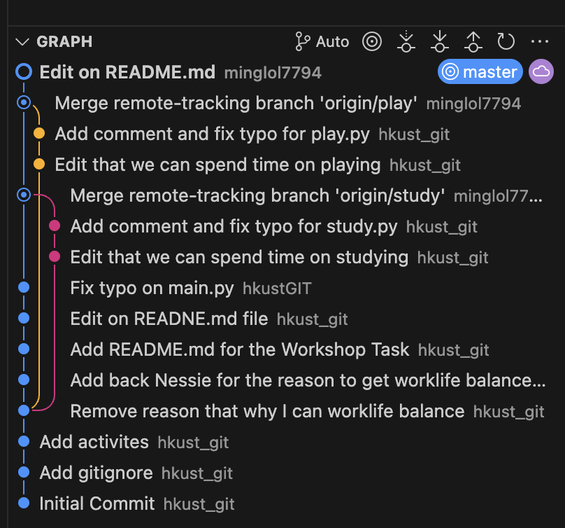

# HKUST COMP4900 Workshop Task

## Step to do
1. Clone this repository to your own computer 
2. Merge `study` and `play` branch to `master` branch
3. Enter your personal information (Name and ITSC) at the end of the `README.md` file
4. Run the `main.py` file and screenshot the output
5. Replace the photo below to the screenshot you have just capture (You can keep the photo if you want)
6. Make the commit for the README.md (Any commit message is fine)
7. Make a repository name `HKUST-COMP4900-<Your ITSC>` on GitHub (e.g `HKUST-COMP4900-lmwongad`) (Remember to make it public)
8. Remove the original remote repository on your local repository
9. Add your own remote repository you have made to your local repository
10. Push your work to your own remote repository
11. Screenshot the commit graph on the left-hand-side of the VSCode
12. Paste your remote repository link and the commit graph screenshot to canvas for hand in

(You can refer [here](https://github.com/hkustGIT/COMP4900-Workshop-Task) for how to do the task)
(The link will be update in later push)
(The commit graph look something like this:)

## Personal Information
Name:

ITSC: 

Screenshot of Output after merge (Replace the Nessie to your screenshot):

Screenshot of Graph after merge (Replce the Nessie to your screenshot)

